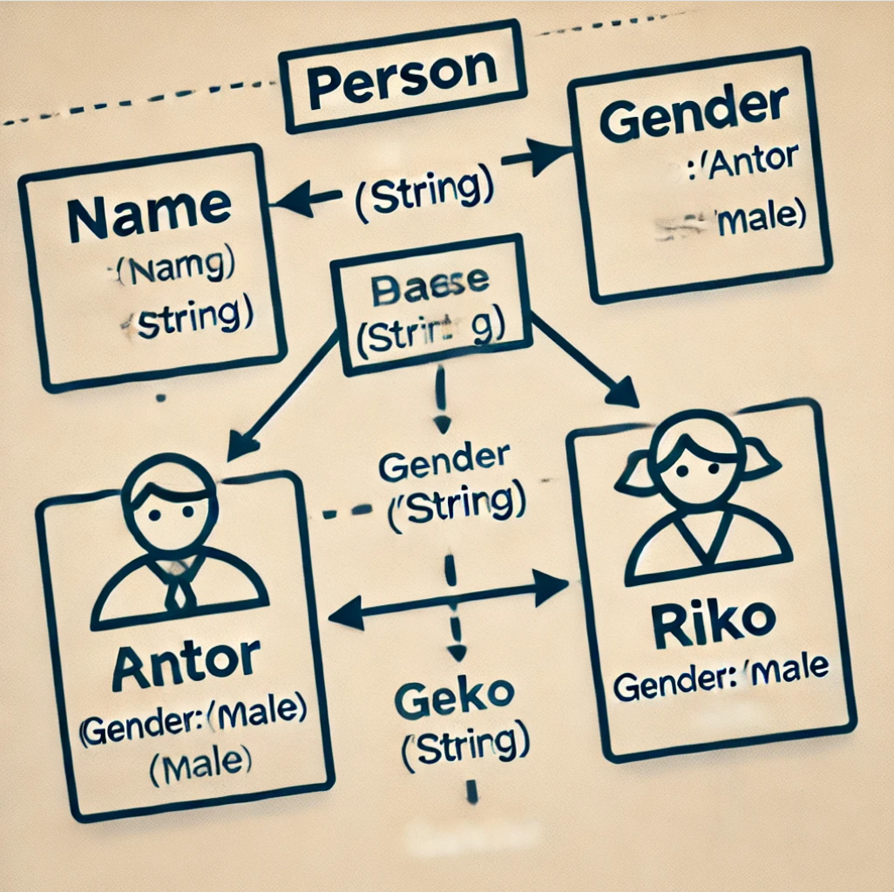
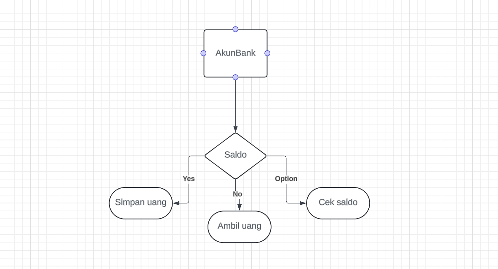
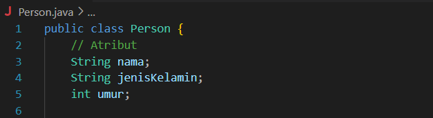
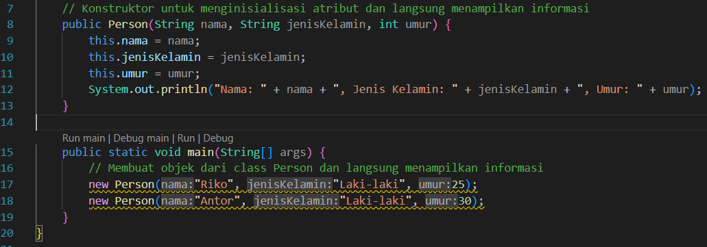
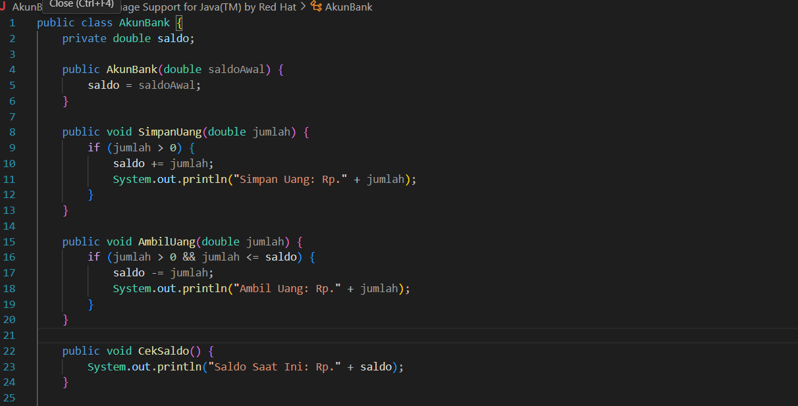
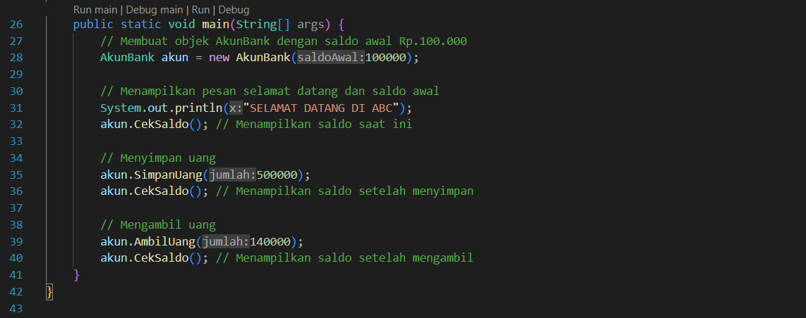
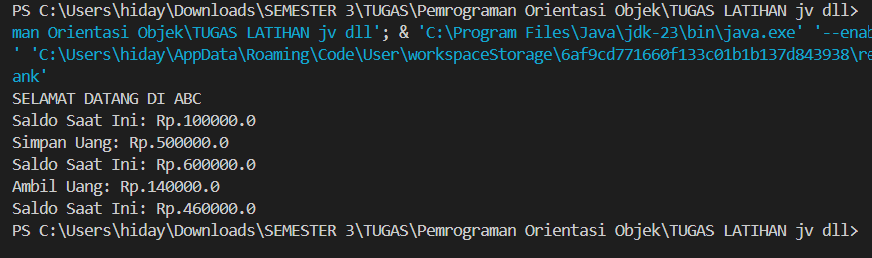

# class&objek
```
NIM     : 312310576
NAMA    : TAUFIK HIDAYAT
KELAS   : TI.23.A6
MATKUL  : Pemrograman Orientasi Objek
```

## Latihan1
- Apa yang harus didefiniskan sebelum membuat objek?
  
Jawabannya adalah harus membuat kelas(class) terlebih dahulu karena menentukan data dan 
fungsi yang dimiliki objek contoh :
```
class Person { 
String name; 
String gender;
}
```
- Untuk inisialisasi objek 
```
Person(String name, String gender) { 
this.name = name; 
this.gender = gender;
}
```

- Buat Diagram gambar 2 objek Riko Dan Antor
  


- Buat gambar diagram objek Akunbank dengan metode instan simpanUang, ambilUang, dan 
cekSaldo.



## Latihan2

- Mendeklarasikan class Person dengan atribut Nama, JenisKelamin, Umur


- Buat 2 Objek class person dengan nama riko dan anton


## Latihan3
- Mendeklarasikan class AkunBank dengan metode instan, SimpanUang, AmbilUang dan 
CekSaldo




- Buat Objek Akunbank




- Output


